[](https://conversao-trilhas.vercel.app)


Converta um roteiro de **trilha de aprendizagem** em um documento HTML, visualize e baixe a trilha.

## Projeto

A ferramenta recebe arquivos do Microsoft Word (`.docx` ou `.doc`), processa o conteúdo e gera um layout visual em HTML, mantendo a estrutura visual padrão dos conteúdos das trilhas de aprendizagem.

Ao baixar a trilha (ctrl + s ou baixar trilha), permite compactar todos os arquivos gerados em um único pacote .zip, facilitando o download e o armazenamento de toda a estrutura da trilha de aprendizagem de forma organizada e prática.

O usuário pode editar os arquivos descompactados normalmente utilizando o Visual Studio Code.

A ferramenta foi desenvolvida para otimizar o trabalho de desenvolvimento de trilhas de aprendizagem, automatizando a conversão de documentos acadêmicos em páginas HTML, reduzindo o tempo de produção e garantindo a padronização visual das trilhas de aprendizagem.

### Ferramentas

O projeto utiliza estas dependências:

- [![Typescript][typescript.ts]][typescript-url]
- [![Tailwindcss][tailwindcss]][tailwindcss-url]
- [![Vite][vite-badge]][vite-url]
- [![Visulima/vite-overlay][visulima/vite-overlay]][visulima/vite-overlay-url]
- [![Mammoth][mammoth]][mammoth-url]
- [![JSZIP][jszip]][jszip-url]
- [![Prettier][Prettier]][prettier-url]

## Instalação

Para clonar e rodar este projeto localmente, é necessário ter o [Git](https://git-scm.com/install/windows) e o [Node.js](https://nodejs.org/pt-br) instalados.

Abra o terminal e execute os comandos abaixo:

1. Clone o repositório

   ```bash
   git clone https://github.com/mauriciompf/conversao_trilhas.git
   ```

2. Entre no diretório

   ```bash
   cd conversao_trilhas
   ```

3. Instale as dependências pnpm

   ```bash
   pnpm install
   ```

4. Entre no branch mais atualizado

   ```bash
   git checkout origin/develop
   ```

5. Crie um servidor local e acesse-o pelo link disponível

   ```bash
   pnpm run dev
   ```

   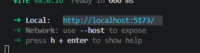

## Utilização

### Adicionar, visualizar e baixar trilhas

Ao entrar no site, clique em **"Adicionar Arquivo"** e selecione o documento Word que deseja converter para HTML. A trilha convertida será exibida automaticamente no formato HTML para visualização.

Para baixar a trilha em formato .zip, clique em **"Baixar Trilha"**. Após extrair o arquivo, todos os arquivos necessários para a trilha de aprendizagem estarão disponíveis.

A quantidade de arquivos gerados varia conforme o modelo utilizado para criar o roteiro da trilha. Por exemplo: se o roteiro foi criado a partir do modelo de **Etapa Única**, ao baixar a trilha você terá os seguintes arquivos, seguindo o padrão das trilhas de aprendizagem:

```markdown
. 📂 nome_da_trilha_de_aprendizagem
└── 📂 css/
│ ├── 📄 style.css # Estilo padrão para todas as trilhas ao serem convertidas e baixadas
├── 📄 inicio.html
└── 📂 materiais/ # Necessário adicionar os arquivos locais prosteriomente
├── 📄 objetos.html
├── 📄 unidade1.html
└── 📄 videos.html
```

Caso o modelo utilizado não esteja disponível, o site exibirá uma mensagem de erro ao tentar baixar a trilha convertida. Ao verificar a pasta descompactada, os arquivos HTML não estarão presentes.

### Lista de modelos disponíveis para baixar

- **Etapa única**
- **Apresentação + 4 etapas**
- **Apresentação + 3 etapas**
- **4 Etapas (sem apresentação)**
- **Apresentação + 3 unidades**

### Armazenamento local & excluir arquivos

Sempre que um novo documento Word for adicionado, o navegador o salvará no armazenamento local (_localStorage_). Assim, caso você saia do navegador enquanto visualiza um documento, ao retornar ao site, o mesmo documento será exibido automaticamente até que você clique em **"Excluir Arquivo Atual"** para removê-lo do armazenamento e da visualização.

### Estrutura condicional do roteiro para a conversão correta

Para uma conversão correta e sem reajustes desnecessários, o roteiro deve estar formatado da seguinte forma:

- **Todo roteiro deverá ter:**
  - **Um cabeçalho** com os dados da trilha sempre no topo do roteiro.  
    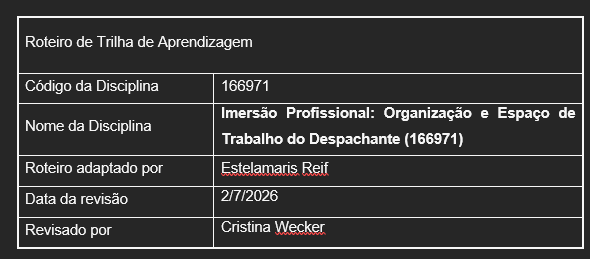  
    Os dados servem para coletar o título e o código da disciplina, além de determinar em qual modelo a trilha foi convertida.

  - **Uma estrutura de tabelas funcionais**: Todo conteúdo do roteiro deve estar inserido em tabelas. É necessário um padrão de tabela que se repita para cada nova seção criada, pois o conversor ainda não consegue identificar e validar a estrutura utilizada. Por exemplo, na imagem abaixo, uma linha foi adicionada acima da tabela de conteúdo — este é um erro explícito, mas a maioria dos erros está implícita. Ao tentar baixar uma trilha com esse tipo de erro, o site exibirá uma mensagem informando que a estrutura é desconhecida.  
    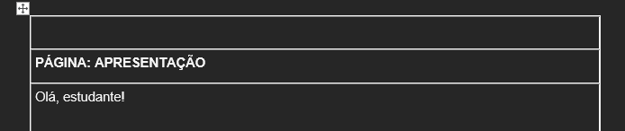  
    **Por que isso acontece?** Ao baixar a trilha, as tabelas são convertidas para containers (div's e classes). Se houver modificação na estrutura padrão, os containers gerados não serão reconhecidos, resultando no erro.

  - **Os títulos de seções** (etapas/unidades) em ordem, sempre no topo e junto ao conteúdo. Exemplo: Apresentação, Etapa 1, Etapa 2, etc.  
    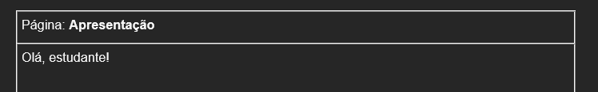  
    Com exceção do modelo Etapa Única, os títulos das seções servem para separar e criar os arquivos HTML de acordo com o modelo.  
    Os títulos não devem conter emojis ou caracteres especiais — apenas a indicação simples da seção. Exemplo: **Página: Etapa 3**

[Aqui está um documento formatado corretamente como exemplo](<./public/readme_asserts/./60%20Trabalho%20de%20Conclusão%20de%20Curso%20(EEA11).docx>)

#### **Idenficação de erros no documento**

Caso observe algum erro no documento, o ideal é editar, salvar e adicionar novamente no site (não há necessidade de excluir o arquivo para adicionar a versão atualizada).

Alguns erros serão visíveis assim que o arquivo Word for adicionado; outros só serão percebidos ao baixar a trilha e editar o HTML diretamente.

Um aviso de erro aparecerá no canto inferior direito:

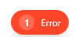

Observe o destaque padrão aplicado apenas aos títulos de seção:

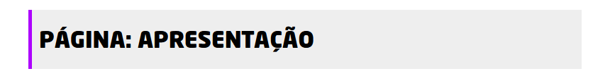

Verifique também a tabela superior: se o valor na linha "Modelo" estiver vazio, significa que algo está errado.

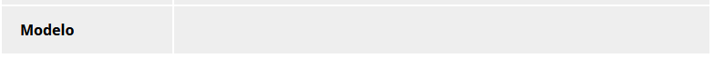

### Como é feito a conversão de elementos importantes

#### **Containers**

Como mencionado anteriormente, os containers são conjuntos de conteúdos convertidos de tabelas para div's com classes específicas. Para cada container, há uma seção separada, dependendo do modelo.

Apenas as tabelas superiores (exceto as tabelas contidas dentro do conteúdo) são convertidas em containers. A tabela de dados superior é especial e não aparecerá na trilha baixada.

Ao baixar a trilha, esses containers recebem a classe padrão `_content-text_`.

#### **Títulos**

Para ser mais eficiente, o conversor determina se um texto é um título dentro do conteúdo com base em certas condições.

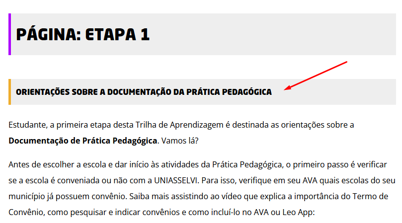

- **Quais são essas condições?**
  - É um parágrafo (tag `<p></p>`);
  - Está em negrito (dentro de uma tag `<strong>`);
  - Possui até 70 caracteres;
  - Não possui nenhuma outra classe;
  - Não contém a tag `<br />`.

Embora recebam uma classe chamada `titulo-secao`, é importante diferenciá-los dos títulos de seção (cor roxa). Os títulos roxos organizam as páginas HTML, enquanto os títulos laranjas servem para dar destaque ao conteúdo seguinte.

Os títulos roxos não serão incluídos ao baixar a trilha.

#### **Elementos textuais**

Todo texto escrito de forma isolada é convertido em um parágrafo em HTML.

Elementos como negrito ou itálico são convertidos exatamente como estão no documento, incluindo caracteres especiais, números e espaços. Isso também se aplica a outros elementos, como listas.

#### **Tabelas**

As tabelas são convertidas exatamente como estão no documento, com exceção da centralização de alguns dados e estilos específicos. Por exemplo, na imagem abaixo, o destaque no rodapé não será mantido após a conversão.

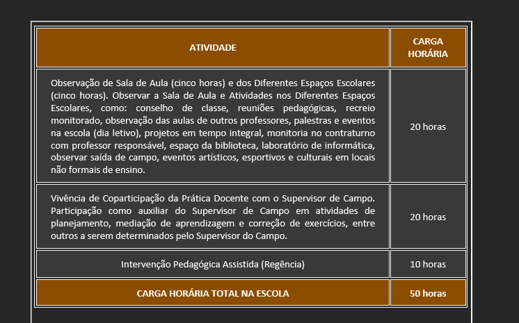

#### **Links locais (Baixar)**

Tanto links locais quanto links diretos serão convertidos com um destaque especial, conforme mostra a imagem abaixo:

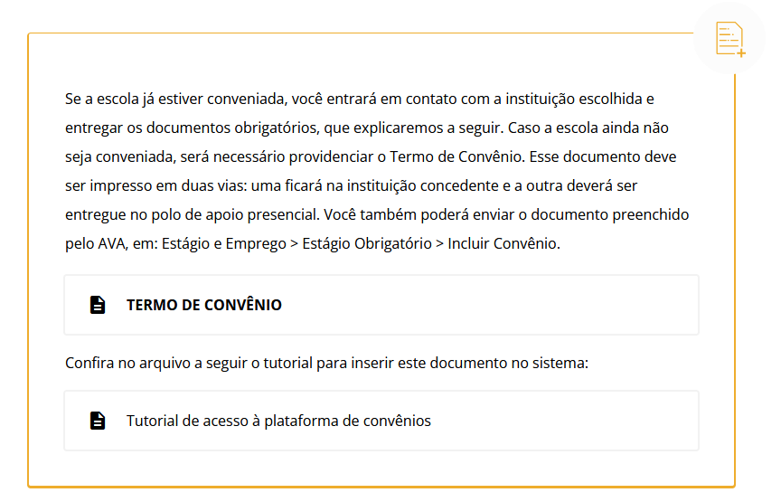

Para indicar ao conversor que um texto é um link para download de um arquivo local, utilize comentários no próprio documento Word como âncora.

Adicione um comentário diretamente na linha em que o texto está selecionado e insira o nome do arquivo no comentário, conforme a imagem abaixo:

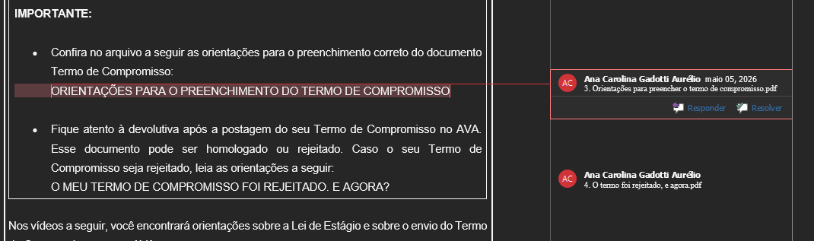

- **Observações importantes:**
  - Adicione comentários apenas em textos que sejam parágrafos. Evite usar em listas, imagens, tabelas ou espaços vazios.
  - Não adicione mais de um comentário no mesmo parágrafo.
  - Verifique o elemento anterior ao texto:
    - O texto do link não pode estar isolado — sempre deve haver um texto anterior.
    - Evite comentários lado a lado com outros comentários.
    - O elemento anterior não pode ser tabela ou imagem (apenas parágrafos ou listas são permitidos). **Dica:** adicione um texto acima do texto do link.
  - Não adicione subcomentários ou respostas no mesmo texto. Caso existam, exclua apenas o subcomentário.
  - Se o texto for muito longo para ser exibido como link, ele será substituído por "Disponível aqui", e o texto original será mantido acima.
  - Caso haja a estrutura "texto > texto link" repetida acima, ambos os elementos serão unificados em um único destaque com links separados.
  - O conversor reconhece códigos de geradores, desde que você não adicione mais de um código por comentário. Veja o exemplo abaixo:
    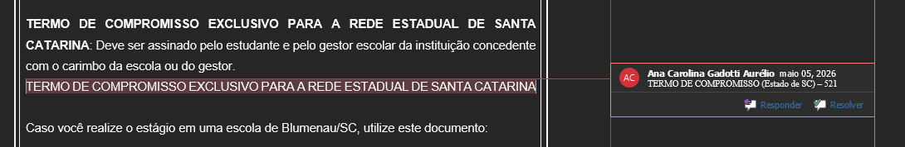
  - Você também pode inserir um hyperlink dentro do comentário — ele será convertido da mesma forma que os arquivos locais (evite mais de um por comentário), com exceção de vídeos do YouTube ou Vimeo.
  - Todos os comentários ficam visíveis na trilha convertida, abaixo do conteúdo, mas não aparecem ao baixar a trilha.
  - **Os arquivos ainda precisam ser baixados e adicionados manualmente à pasta `materias/` após o download da trilha.**

#### **Links diretos (Hyperlinks)**

Na maioria dos casos, utilize hyperlinks por meio de comentários. Caso prefira adicioná-los como parágrafo, siga estas observações:

- O link deve estar junto (ao lado) do parágrafo, sendo precedido pelo texto anterior.
- O texto do link deve ser sempre "Disponível aqui".
- Não adicione dois ou mais links no mesmo parágrafo.

#### **Vídeos Youtube/Vimeo**

Vídeos do YouTube ou Vimeo devem estar isolados, conforme a imagem abaixo:

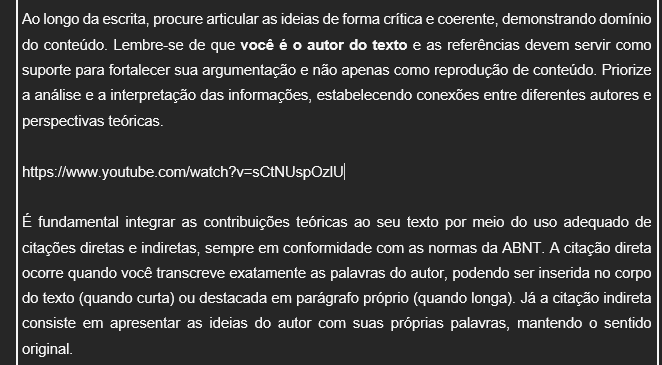

Lembre-se de sempre verificar o texto anterior ao link do vídeo.

#### **Listas**

Algumas listas formatadas ou não no documento Word podem não ser convertidas exatamente como aparecem no original.

#### **Imagens**

Imagens inseridas no roteiro serão convertidas para [Base64](https://developer.mozilla.org/pt-BR/docs/Glossary/Base64) durante a visualização. Ao baixar a trilha, serão convertidas de volta para o formato original (.png, .jpeg, etc.) e armazenadas em uma nova pasta chamada `imgs/`, em ordem de aparição no roteiro. A adição da imagem no código será feita automaticamente.

A imagem sempre será exibida centralizada e com o tamanho original.

O atributo `alt` permanecerá vazio caso não seja previamente definido no documento.

#### **Destaques manuais (pelo roteiro)**

Ao criar uma tabela (dentro do conteúdo, com uma única linha e coluna) ao redor de um texto, ela será convertida em um container com a classe de destaque `outline-colorido`, conforme a imagem abaixo:

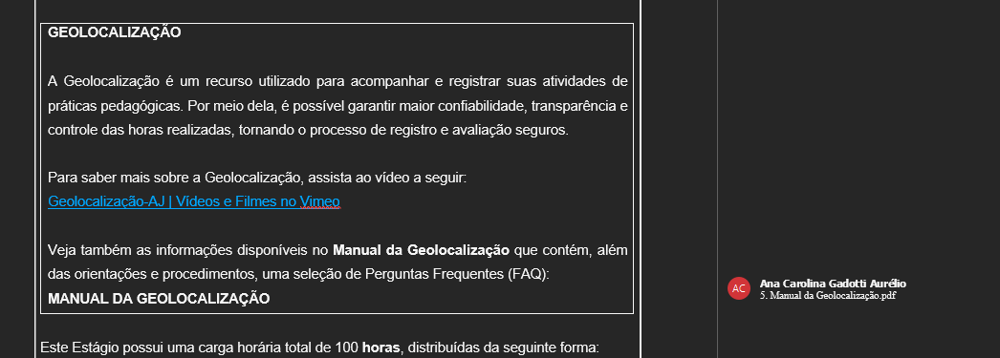

Na imagem acima, há um comentário dentro do conteúdo em destaque. Nesse caso, o destaque do comentário link terá prioridade sobre o destaque `outline-colorido`.

Para adicionar destaques editando diretamente o documento Word, insira `$<nome de uma classe>$` ao lado de um parágrafo de texto. Isso criará um container cobrindo o parágrafo com a classe de destaque correspondente, como no exemplo:

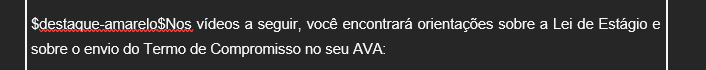

Para aplicar o destaque a mais de um parágrafo, adicione `$0$` no início e `$1$` ao lado do último parágrafo, delimitando o intervalo, conforme o exemplo:

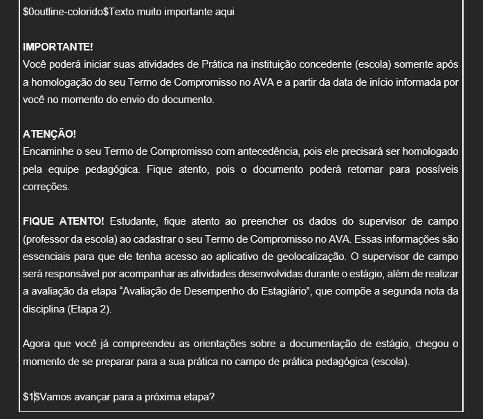

- **Lista de classes disponíveis para destaque**:
  - `destaque-titulo`
  - `aviso`
  - `destaque-amarelo`
  - `outline-colorido`
  - `titulo-secao`
  - `code`
  - `citacao`

**Evite aplicar esses destaques em listas, imagens, tabelas ou outros elementos estruturais.**

### Título da pasta da trilha

Ao baixar a trilha, o nome do arquivo .zip seguirá o padrão de nomenclatura das trilhas de aprendizagem:

`<codigo_da_disciplina>_<nome_da_disciplina>`

O nome da disciplina deve ser curto — apenas duas palavras após o código — para facilitar o padrão e o link final. Tanto o código quanto o nome são coletados a partir da tabela de dados superior.

Trilhas que contenham "ensino" ou "conclusão" no nome podem incluir esses termos no título final por conveniência.

### Edição do HTML

Após baixar a trilha, você pode editar toda a estrutura HTML de forma padrão.

Também é possível editar o HTML diretamente pelo "Inspecionar" do navegador antes de baixar. **Importante:** o navegador não salvará nenhuma alteração feita via inspeção caso você recarregue ou saia da página.

## Recursos em pendência

- Adicionar mais mensagens personalizadas para possíveis erros
  - Limite de tamanho do localStorage atingido
- Traduzir mensagens de erro para PT-BR
- Adicionar destaques para podcasts
- Melhorar a visualização dos comentários, vinculando-os aos textos correspondentes no conteúdo
- Permitir edição do HTML convertido diretamente no site e salvar alterações no navegador
- Melhorar destaques manuais para tabelas, imagens e listas
- Melhorar a dinâmica de arquivos locais, eliminando a necessidade de adição manual
- Adicionar todos os códigos de geradores restantes
- Adicionar testes unitários
- Adicionar suporte a links locais e diretos em tabelas, listas e imagens
- Ampliar as opções de estilos para destaques
- Remover tags `<br />` desnecessárias em parágrafos
- Adicionar os modelos de trilhas restantes
- Adicionar validação da estrutura do roteiro (documento Word)
- Melhorar a navegação pela trilha
  - Adicionar botão para voltar ao topo da página
- Melhorar a conversão de tabelas e listas específicas

## Como contribuir

1. Clone o repositório e cria uma nova branch: `$ git checkout https://github.com/mauriciompf/conversao_trilhas -b nome_da_branch`.
2. Faça as mudanças e teste.
3. Mande um Pull Request com uma descrição completa para a branch `develop`.

## Para conhecimento

Este projeto foi elaborado e desenvolvido inicialmente por **Maurício Pinto Farias**, com o objetivo de contribuir para a eficiência no desenvolvimento das trilhas de aprendizagem da empresa Vitru Educação.

[typescript-url]: https://www.typescriptlang.org/
[typescript.ts]: https://img.shields.io/badge/TypeScript-3178C6?style=for-the-badge&logo=typescript&logoColor=white
[tailwindcss-url]: https://tailwindcss.com/
[tailwindcss]: https://img.shields.io/badge/Tailwind_CSS-grey?style=for-the-badge&logo=tailwind-css&logoColor=38B2AC
[mammoth-url]: https://www.npmjs.com/package/mammoth
[mammoth]: https://img.shields.io/badge/Mammoth-000?style=for-the-badge&logo=npm&logoColor=white
[jszip-url]: https://www.npmjs.com/package/jszip
[jszip]: https://img.shields.io/badge/JSZip-000?style=for-the-badge&logo=npm&logoColor=white
[visulima/vite-overlay-url]: https://github.com/visulima/vite-overlay
[visulima/vite-overlay]: https://img.shields.io/badge/Vite_Overlay-646CFF?style=for-the-badge&logo=vite&logoColor=white
[prettier-url]: https://prettier.io/
[Prettier]: https://img.shields.io/badge/Prettier-1A2C34?style=for-the-badge&logo=prettier&logoColor=F7B93E
[vite-url]: https://vitejs.dev/
[vite-badge]: https://img.shields.io/badge/Vite-646CFF?style=for-the-badge&logo=vite&logoColor=white
